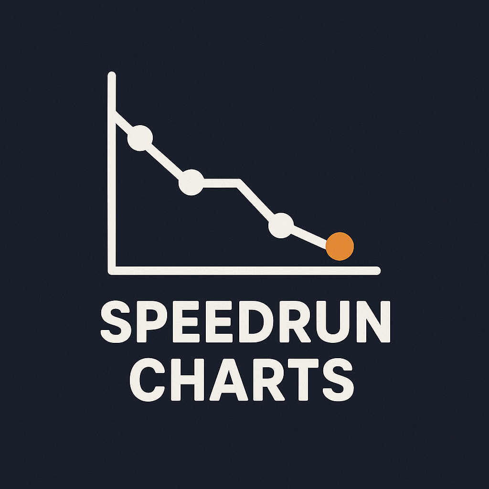

# Speedrun-Charts-v2

**Visualize and explore speedrun world record progressions with interactive charts.**

Live Demo: [speedrun-charts-v2.vercel.app](https://speedrun-charts-v2.vercel.app)

---

##  Features

- Interactive charts showing world record progressions over time.
- Dynamic filtering by game, category, and level.
- Real-time data fetching—ensure you're viewing the latest verified runs.
- Built using TypeScript and Vite for fast, modern development.

---

##  Technology Stack

- **Frontend**:  
  - Vite  
  - TypeScript  
  - MUI x Charts

- **Hosting / Deployment**:  
  - Deployed via Vercel ([speedrun-charts-v2.vercel.app](https://speedrun-charts-v2.vercel.app))

---

##  Getting Started

### Prerequisites

- Node.js (v16+ recommended)
- npm or yarn

### Installation

```bash
git clone https://github.com/BryanHuynh/Speedrun-Charts-v2.git
cd Speedrun-Charts-v2
npm install
```